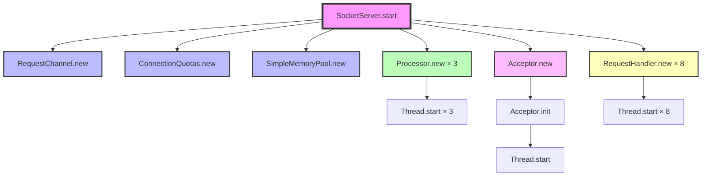
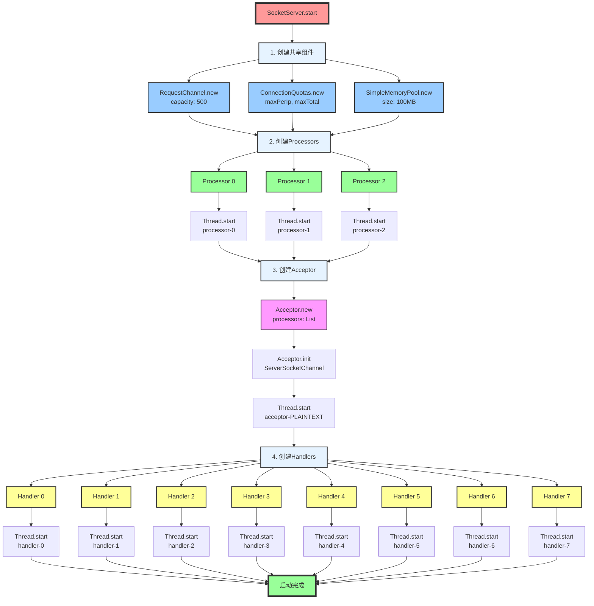
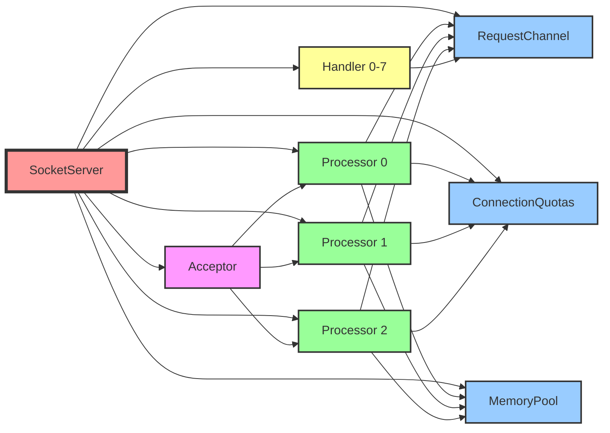
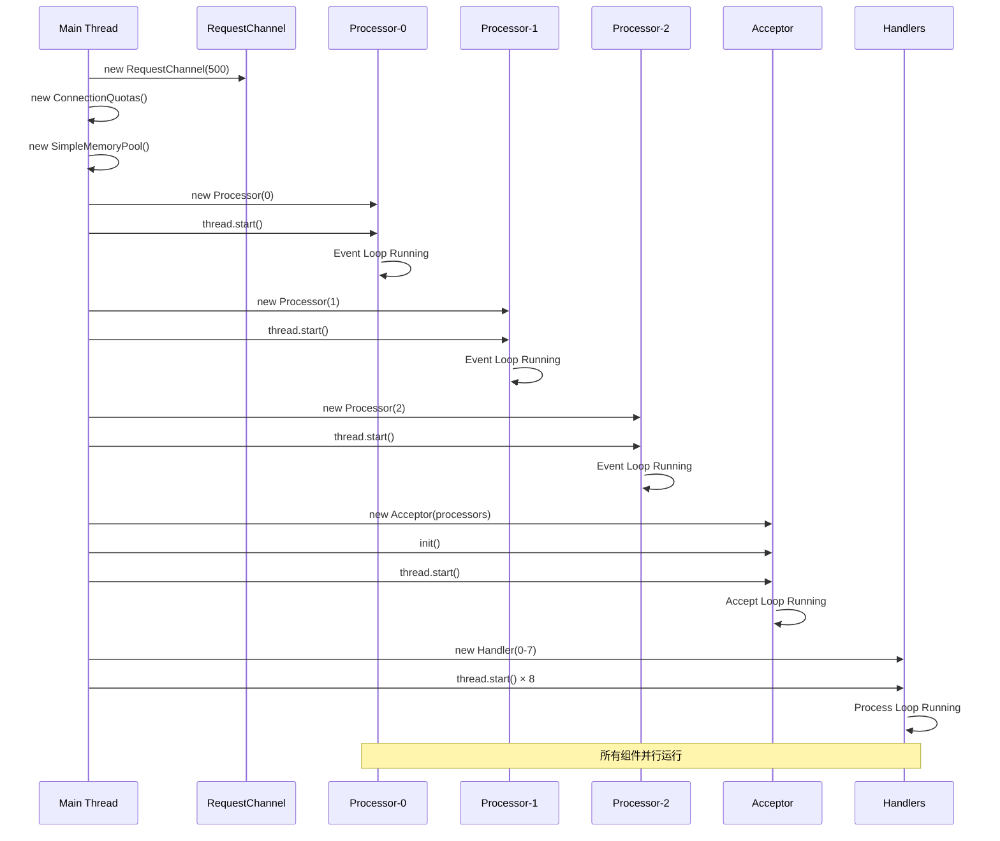
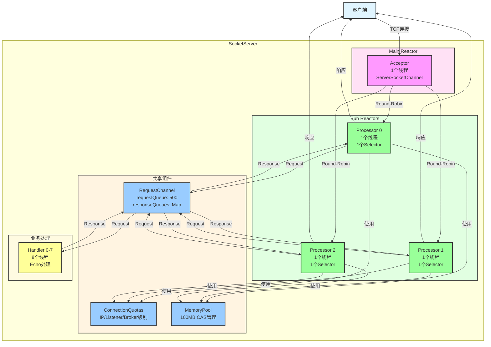
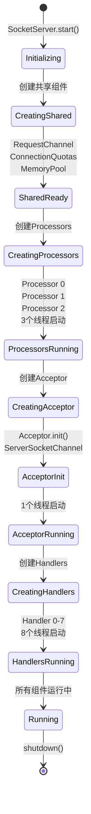
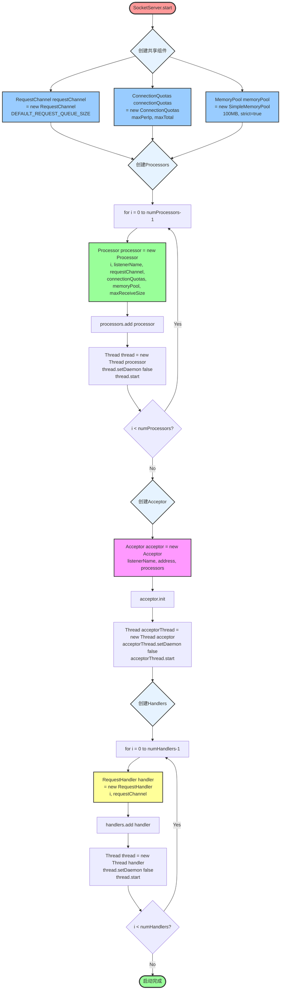

# Kafka Reactor - Mermaid 架构图

## 1. SocketServer 启动流程（简化版）

## 2. SocketServer 启动流程（详细版 - 按执行顺序）

## 3. 组件依赖关系图

## 4. 线程启动时序图

## 5. 完整架构图（运行时）

## 6. 启动流程状态图

## 7. 类实例化顺序（代码级别）

## 使用说明

### 在Markdown中渲染

将以上任意一个代码块复制到支持mermaid的markdown编辑器中（如Typora、GitHub、GitLab等）即可看到图表。

### 在线预览

访问 [Mermaid Live Editor](https://mermaid.live/) 粘贴代码即可预览。

### 图表说明

1. **图1**：最简化的调用关系，适合快速理解
2. **图2**：详细的启动流程，展示4个阶段和所有实例
3. **图3**：组件依赖关系，展示共享组件的使用
4. **图4**：时序图，展示线程启动的时间顺序
5. **图5**：完整架构图，展示运行时的交互关系
6. **图6**：状态图，展示启动过程的状态转换
7. **图7**：代码级别的实例化流程，包含循环

### 颜色说明

- 🟥 红色：入口/主要流程
- 🟦 蓝色：共享组件（RequestChannel、ConnectionQuotas、MemoryPool）
- 🟩 绿色：Processor（Sub Reactors）
- 🟪 紫色：Acceptor（Main Reactor）
- 🟨 黄色：Handler（业务处理器）
